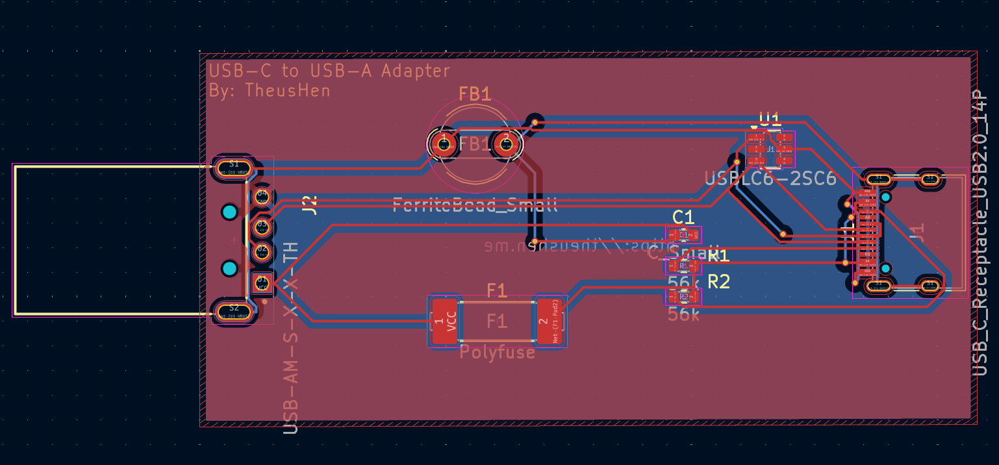

# USB-C to USB-A Adapter
My first PCB, warming up and learning to Hack Club Highway 2026!

## PCB:

*Layers: 2*

*Dimensions: 30.6 x 63.2 mm*

### License: [GPLv3](https://www.gnu.org/licenses/gpl-3.0.html)